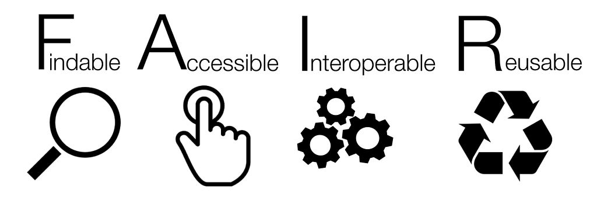

<figure>
    
</figure>

# FAIR principles

## Lesson outcomes

* Describe/summarize  FAIR principles
* Apply/follow FAIR principles throughout research project
* List good resources for FAIR data management information

These will be achieved with written information as lesson notes + examples + exercies, practical parts using Moodle/ Kahoot

Solution example

  blahdiblah

