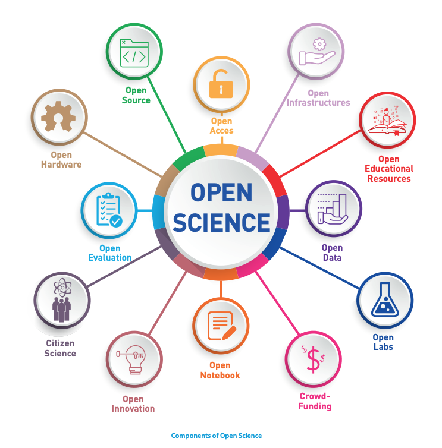

 
 # Introduction
 
## Open Science

In the last few years, more attention has been put on what a researcher does with their research outputs. Whether this would be data, code, software, or anything else. In 2015, Estonian Research Council established the Open Science Expert Group which has compiled the general principles and policy recommendations document ([Estonian](https://www.etag.ee/wp-content/uploads/2016/07/Avatud_Teadus_Eestis_1.0.pdf),[English](https://www.etag.ee/wp-content/uploads/2017/03/Open-Science-in-Estonia-Principles-and-Recommendations-final.pdf))  for Open Science in Estonia.

The definition of Open Science denotes free access to the electronic scientific information, particularly to publications and research data created and published as a result of public funding.

<figure>
    
</figure>

### Why is Open Science useful?
Publicly accessible scientific information makes research more effective and faster:
- Less data duplication 
- More research results with the same basic data 
- Visibility and citation of the research results will grow 
- Availability of data increases the transparency of research and therefore it contributes to the research quality 
- Feedback to the state and society
- Economic effect and positive impact on innovation

To ease the burden of trying to archive or publish the data at the end of the project, it is recommended to think about what you want to do with your research outputs at the beginning of the project. Funder’s require grant applicants to write data management plans to have an overview of their data and best practices of handling it. What also needs to be noted is that most of these practices you are probably already using.

### Open Science Resources in Estonia

- Estonian Research Council (ETAG) page about [Open science](https://etag.ee/en/activities/open-science/) 
- Research Data Management and Publishing open educational [resource](https://sisu.ut.ee/andmekursus/home0) about Open Science and Data Management plan By University of Tartu Library. Additional pages about [Open Science](https://utlib.ut.ee/en/open-science) and [Data Management Plan](https://utlib.ut.ee/en/data-management-plan-dmp)
- Tallinn University of Technology Library page about [Open Science](https://taltech.ee/en/library/open-science), [research data management](https://taltech.ee/en/library/research-data-management) and [data management plan](https://taltech.ee/en/library/data-management-plan)
- Estonian University of Life Sciences Library page about [Open Science](https://library.emu.ee/en/research/open-science/) and [research data management](https://library.emu.ee/en/research/research-data-management/)
- Tallinn University page about [Open Science](https://www.tlu.ee/avatud-teadus) (in Estonian)
- Open Science in Estonia [home page](https://www.avatudteadus.ee/en/home/) and [Facebook page](https://www.facebook.com/avatudteadus) with events

---------------------------------------

## FAIR

In 2016, the [FAIR Guiding Principles for scientific data management and stewardship](https://www.nature.com/articles/sdata201618) were published in Scientific Data. The intention of these principles is to improve the Findability, Accessibility, Interoperability and Reuse of digital assets.

<figure>
    
</figure>

### Why is FAIR needed?

- Life science research becomes data-intensive 
  - Increasing data volume 
  - Increasing data complexity 
  - Speed of data creation makes scientists rely on computational support exponentially
- Traditional ‘wet labs’ make space for ‘dry’ (computer) labs
- Knowledge discovery- enhancing the ability of machines and scientists to find and use data
- Improve research transparency

## FAIR Resources in Estonia

- ELIXIR-Estonia has slides available in Zenodo
    - Estonian: [The FAIR Principles Lecture](https://doi.org/10.5281/zenodo.5533534)
    - English: [The FAIR Principles Lecture](https://doi.org/10.5281/zenodo.5572352) and [FAIR in a Nutshell](https://doi.org/10.5281/zenodo.7660008)
    - [Flyers for FAIR](https://doi.org/10.5281/zenodo.5769084) 

We have divided the data management practices into subsections that can be viewed on the tabs on the left. Under these tabs, you can find a brief overview of the subject, recommendations for Estonian researchers, any extra materials produced by ELIXIR Estonia on the subject, and references, where you can get more detailed information. 

## General Resource

Additionally, we recommend visiting [RDMkit](https://rdmkit.elixir-europe.org/), generated and maintained by ELIXIR. It is an online guide on data management throughout the research project lifecycle. It has guidelines, information, and pointers to help you with the problems that you may encounter. 

---------------------------------------

## Image sources

* The Components of Open Science. From "Towards a UNESCO recommendation on open science: building a global consensus on open science". https://unesdoc.unesco.org/ark:/48223/pf0000373209.locale=en
* FAIR data by 	SangyaPundir. CC BY-SA  https://commons.wikimedia.org/wiki/File:FAIR_data_principles.jpg
